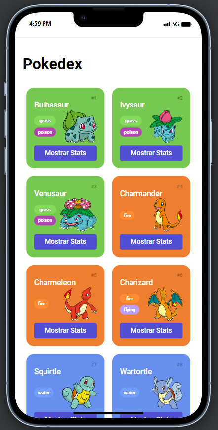
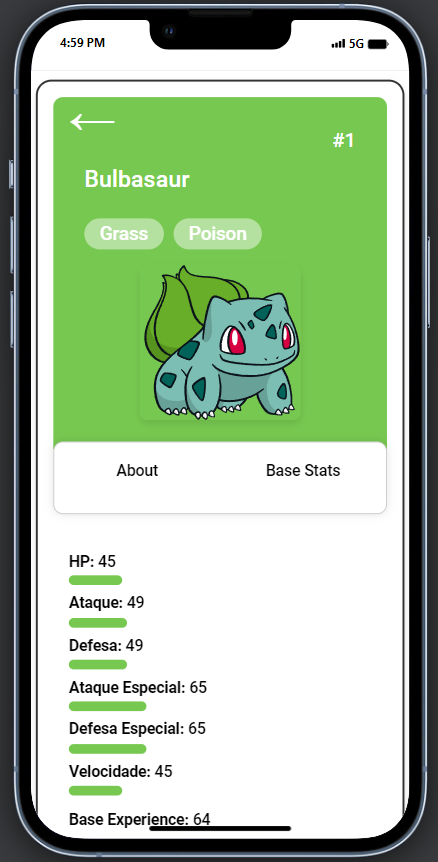

# Trilha JS Developer - Pokedex

Este é um projeto para criar um site interativo utilizando uma API de Pokémon. O objetivo é fornecer aos usuários uma plataforma onde possam explorar informações detalhadas sobre diferentes Pokémons, incluindo habilidades e características únicas. Este projeto é desenvolvido em HTML, CSS e JavaScript, e utiliza uma API pública de Pokémon para obter dados em tempo real.

## Tecnologias Utilizadas

## Imagens do Projeto

## Divirta-se explorando o fascinante mundo dos Pokémon! 🚀🎮